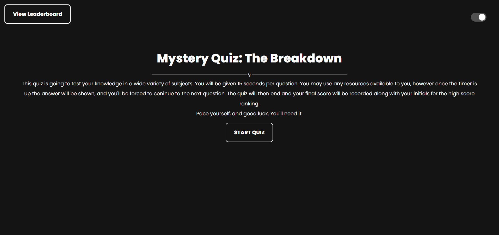

# Mystery-Quiz

https://junoandice.github.io/Mystery-Quiz/

## Description
A short quiz for fun that gives the user 15 seconds per question to answer. The quiz is full of random questions of random subjects and a score is saved at the end.

## Installation

N/A

## Screenshots

## Usage
The site features a main landing page with quick info on the quiz and it's functions. The quiz will then begin once the user presses start quiz. The timer will count down. Once the user selects an answer or time runs out, the correct answer is shown, and the quiz continues. Once all questions have been went through. A final score is displayed at the end with a form to enter initials. Once initials are entered it is then passed to a leaderboard that shows all the players and their highest score. Initials are required. The user can then remove all the scores, or play again.
## Credits

Ediubong Ekwere | Juno and Ice

Christopher Banta | https://github.com/BantaChristopher

GreatStack | https://www.youtube.com/watch?v=PBcqGxrr9g8&t=1462s

## License

MIT © Juno and Ice